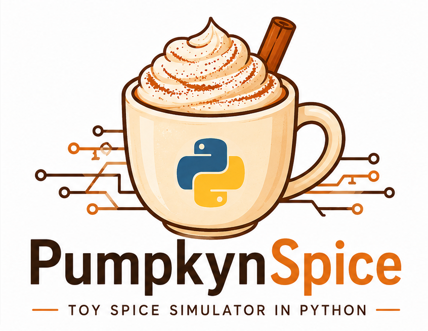
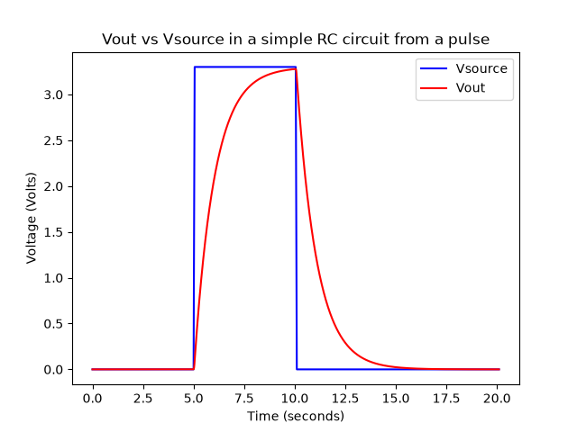

<p align="center">
  
</p>

<h1 align="center">pumpkynspice</h1>

<p align="center">
  A tiny, from-scratch circuit simulator for learning, tinkering, and benchmarking pure Python vs. NumPy.
</p>

<p align="center">
  
  
  
</p>

---

## What is this?

**pumpkynspice** simulates the step response of a simple first-order **RC circuit** driven by a trapezoidal voltage pulse (rise → high → fall → low). It numerically integrates the classic RC charging equation using forward-Euler updates:

```
i_R(t)     = (Vs(t) - Vout(t)) / R
Vout(t+dt) = Vout(t) + i_R(t) * dt / C
```

```
                      R
         Vs(+) ---/\/\/\/\---+---> Vout
                             |
                            === C
                             |
                            GND
```

The project currently ships one implementation:

| File       | Description                                                             |
|------------|--------------------------------------------------------------------------|
| `slow.py`  | Pure-Python reference implementation (plain lists + `for` loops).       |

A **NumPy-vectorized version is planned** (`fast.py`, working name) to benchmark against `slow.py` and see how much speedup vectorization buys us as input sizes grow.

## Example output

Running the simulator with the default parameters (a 3.3V pulse from 5s–10s) produces the following waveform:

<p align="center">
  
</p>

## Getting started

### Requirements

- Python 3.14 (uv's default on this machine — no need to pin it explicitly)
- [uv](https://docs.astral.sh/uv/) for environment/dependency management
- [matplotlib](https://matplotlib.org/)

### Setup

```bash
uv add matplotlib
```

This adds `matplotlib` to `pyproject.toml`, updates `uv.lock`, and syncs your `.venv`.

### Run it

```bash
uv run slow.py
```

This will print `Hello from pumpkynspice!`, run the simulation, and save the resulting plot to `output.png` in the current directory.

## Tweaking the simulation

All the interesting parameters live in `main()` inside `slow.py`:

| Parameter | Meaning                                      | Default |
|-----------|-----------------------------------------------|---------|
| `R`       | Resistance (Ohms)                              | `10e3`  |
| `C`       | Capacitance (Farads)                           | `100e-6`|
| `Vs_max`  | Peak source voltage (Volts)                    | `3.3`   |
| `dt`      | Simulation time step (seconds)                 | `0.001` |
| `t_start` | Low period before the pulse begins (seconds)   | `5.0`   |
| `t_ramp`  | Rise/fall time of the pulse edges (seconds)    | `0.05`  |
| `t_high`  | Duration the source stays high (seconds)       | `5.0`   |
| `t_low`   | Duration the source stays low, at the end (seconds) | `10.0` |

Smaller `dt` gives a smoother, more accurate curve at the cost of more steps to simulate — which is exactly the kind of workload this project wants to speed up.

## Roadmap

- [ ] Expose simulation parameters as CLI args / function inputs (in progress)
- [ ] Add Backward Euler integration
- [ ] Add Non-Linear Elements (diodes, transistors)
- [ ] Add State-Space/Matrix Methods of solving for more complex circuits
- [ ] Add a NumPy-vectorized implementation (`fast.py`)
- [ ] Benchmark `slow.py` vs. `fast.py` across a range of input sizes
- [ ] Maybe: swap forward-Euler for a higher-order integrator (RK4)
